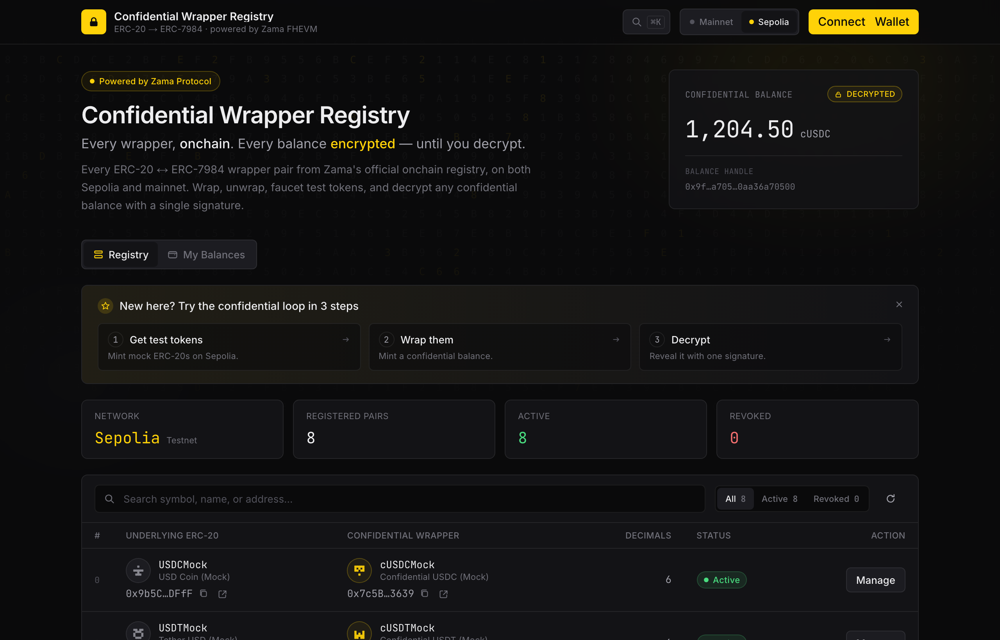
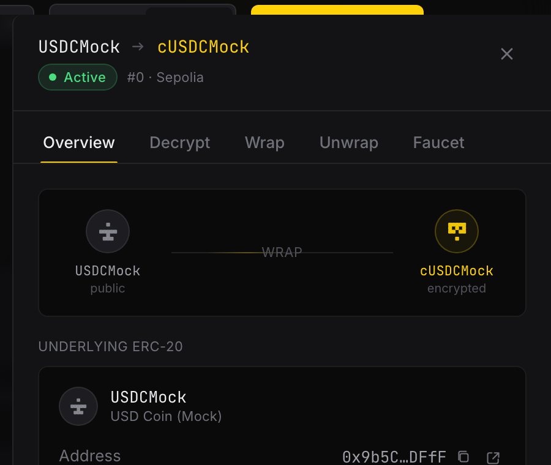
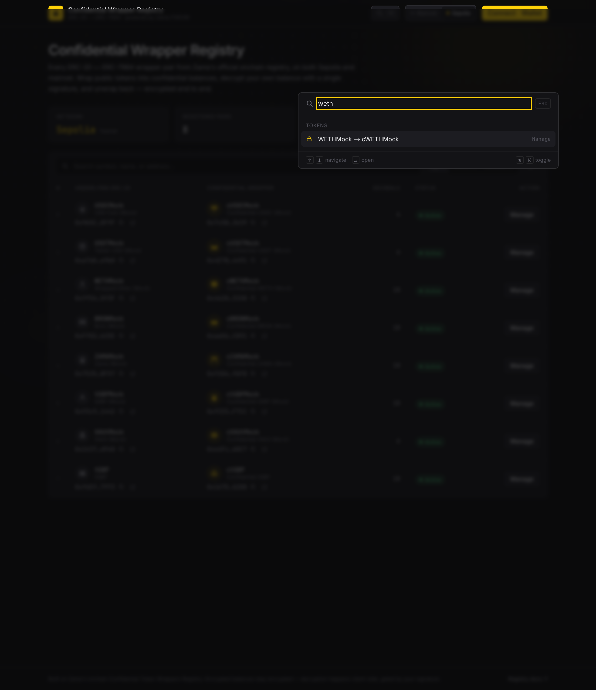

# Confidential Wrapper Registry

A production-grade web app that turns Zama's official onchain **Confidential Token
Wrappers Registry** into a usable product. Browse every ERC-20 → ERC-7984 wrapper
pair on **Sepolia and Ethereum mainnet**, wrap public tokens into confidential
balances, decrypt your own balance with a single signature, unwrap back, and
faucet test tokens on Sepolia.

Built for the **Zama Developer Program — Season 3 Bounty Track**.

> **Live demo:** _deploy with `vercel deploy` and paste the URL here_
> **Networks:** Sepolia (`11155111`) · Ethereum mainnet (`1`)



Per-pair actions live in a drawer with Overview / Decrypt / Wrap / Unwrap / Faucet
tabs. Every state — including "connect your wallet" and revoked pairs — is designed.



### Design language — "Ciphertext"

The interface treats encryption as its material. Encrypted balances render as
*live* cycling hex glyphs and resolve with a left-to-right **decryption cascade**
on unlock; the surface carries a breathing aurora over a faint drifting hex field;
token avatars are deterministic hash-derived seals; and a **⌘K command palette**
jumps to any token, switches network, or runs an action. All motion honours
`prefers-reduced-motion`. Full spec in [DESIGN.md](DESIGN.md).



---

## What it does

| # | Feature | Summary |
|---|---------|---------|
| 1 | **Registry Explorer** | Reads every `TokenWrapperPair` from the registry on both networks via `getTokenConfidentialTokenPairsLength` + paginated `getTokenConfidentialTokenPairsSlice`. Resolves each side's metadata. Revoked pairs (`isValid=false`) are shown with a clear status and have wrap/unwrap blocked — never hidden. |
| 2 | **Wrap / Unwrap** | Wrap = ERC-20 `approve` (exact amount, allowance-aware) → wrapper `wrap`. Unwrap = the two-phase encrypted flow (burn → relayer reveal → `finalizeUnwrap`) with staged status. Decimals are always read on-chain — never hardcoded. |
| 3 | **Confidential balance decryption** | EIP-712 user-decrypt on **both networks** (Sepolia + mainnet): fetch the balance handle → `generateKeypair` → `createEIP712` → sign once → `userDecrypt`. The session is cached so you sign **once per session**, not per token. Works for **any ERC-7984 token, registered or not** (paste-an-address). A `bytes32(0)` handle renders "No balance yet" and is never sent to the relayer. |
| 4 | **Sepolia faucet** | One-click `mint` of the underlying mock token (the wrappable side of each cTokenMock), with a client-side per-address cooldown and clear feedback. |

Beyond the four required features, the app adds judging-grade UX depth:

| | Feature | Summary |
|---|---------|---------|
| 5 | **My Balances portfolio** | Reads every confidential balance you hold across the registry in one multicall and decrypts them **all with a single signature** (one cached session), each resolving with the cascade. Includes a **"decrypt any ERC-7984"** paste-an-address box for tokens outside the registry. |
| 6 | **Onboarding** | First-run Sepolia guide — Faucet → Wrap → Decrypt — that deep-links into the right drawer tab so the full confidential loop is three clicks away. |
| 7 | **Resilient unwrap** | The two-phase unwrap persists its request before finalizing, so a failed phase-2 is **resumable** — burned funds are never stranded. |
| 8 | **Global toasts** | Staged tx notifications with explorer links, in an ARIA live region. |

---

## Architecture

```
app/                      Next.js App Router entry (server) + client providers
  layout.tsx              Inter + JetBrains Mono fonts, metadata
  providers.tsx           wagmi + react-query
  page.tsx                Explorer screen
lib/
  networks.ts             SINGLE source of addresses (registry per chain) + chain metadata
  abis.ts                 Minimal, verified ABI fragments (registry, ERC-20, ERC-7984 wrapper)
  registry/useRegistry.ts Data-driven registry read: length → slices → multicall metadata
  fhevm/instance.ts       Singleton relayer-SDK instance (initSDK once, memoized)
  fhevm/useDecryptSession Sign-once EIP-712 user-decrypt session cache
  fhevm/useConfidentialBalance  Reads the bytes32 balance handle
  useActionFlow.ts        idle → pending(step) → success | error state machine
  hooks/                  token state, write-and-wait, faucet cooldown
components/
  registry/               Explorer table, PairDrawer, Wrap/Unwrap/Decrypt/Faucet panels
  ui/                     Design-system primitives (Button, Card, Badge, Address, …)
contracts/                Hardhat + FHEVM-mock test package (see Testing)
DESIGN.md                 The design system every screen is held to
```

### Hybrid registry — onchain truth + local overrides

The registry is sourced as a **hybrid**, exactly as the brief requires:

1. **Onchain (source of truth).** `getTokenConfidentialTokenPairsLength()` then
   paginated `getTokenConfidentialTokenPairsSlice(from, to)`, with a single
   multicall resolving `name`/`symbol`/`decimals` for both sides. The app
   **never hardcodes a token list** — a newly registered pair appears
   automatically, with zero code changes.
2. **Local config (custom / dev-only).** [`lib/registry/customPairs.ts`](lib/registry/customPairs.ts)
   declares extra pairs that are merged on top of the onchain set. Onchain pairs
   win on conflicts; local-only pairs are tagged **"Local"** in the UI. Metadata
   for local pairs is still resolved on-chain — you only supply the two addresses.

#### How to add a new ERC-20 ↔ ERC-7984 pair

**Option A — register it onchain** (makes it canonical for everyone): call
`registerConfidentialToken(erc20, wrapper)` on the Wrappers Registry. It appears
in the app on next load, no code change.

**Option B — declare it locally** (custom or not-yet-registered): add one entry
to `lib/registry/customPairs.ts` and reload:

```ts
export const CUSTOM_PAIRS: Record<SupportedChainId, CustomPair[]> = {
  [sepolia.id]: [
    { token: "0xYourErc20...", confidentialToken: "0xYourErc7984Wrapper..." },
  ],
  [mainnet.id]: [],
};
```

Don't have a pair to hand? Deploy a fresh ERC-20 + its ERC-7984 wrapper to
Sepolia in one command — it prints the exact line to paste above:

```bash
cd contracts
SEPOLIA_RPC_URL=<rpc> DEPLOYER_PRIVATE_KEY=0x<key> npm run deploy:custom
# ✓ deploys MockERC20 + ConfidentialMockWrapper, mints you some underlying,
#   and prints:  { token: "0x…", confidentialToken: "0x…" },
```

(Script: [`contracts/scripts/deploy-custom-pair.ts`](contracts/scripts/deploy-custom-pair.ts).)
Either way the pair shows up with resolved metadata and full wrap/unwrap/decrypt
support, tagged "Local". Adding a whole new network is a one-object edit in
[`lib/networks.ts`](lib/networks.ts) plus a relayer config in
[`lib/fhevm/instance.ts`](lib/fhevm/instance.ts).

---

## Tech stack

- **Next.js 14** (App Router) + **TypeScript**
- **wagmi v2** + **viem** (injected wallet, multicall, fallback public RPCs)
- **@zama-fhe/relayer-sdk** (bundle import; `initSDK()` WASM before `createInstance`)
- **Tailwind CSS** with a custom token layer encoding `DESIGN.md`
- **Hardhat** + **@fhevm/hardhat-plugin** mock + **@openzeppelin/confidential-contracts** for tests

Verified against `@fhevm/solidity@0.11.1`, `@zama-fhe/relayer-sdk@0.4.3`,
`@openzeppelin/confidential-contracts@0.4.x`. Uses the current API only — `FHE`
(not `TFHE`), and the off-chain decrypt + on-chain `FHE.checkSignatures` unwrap
path (no removed `FHE.requestDecryption`).

---

## Setup

```bash
# 1. Frontend
npm install
cp .env.example .env.local      # optional: add private RPC URLs
npm run dev                     # http://localhost:3000

# 2. Type-check, build, unit tests
npm run typecheck
npm run build
npm run test                    # vitest — pure helper coverage

# 3. Contract-interaction tests (FHEVM mock)
cd contracts
npm install
npm test                        # hardhat — 13 tests on the mock node
```

Public RPCs are used by default (fine for browsing). For production reliability,
set `NEXT_PUBLIC_SEPOLIA_RPC_URL` / `NEXT_PUBLIC_MAINNET_RPC_URL`.

### Deploy to Vercel

The repo is Vercel-ready (`vercel.json`, `next build` passes clean). Import the
repo or run `vercel`. No environment variables are required to boot; add RPC URLs
for production.

---

## Testing

Two suites, both runnable and green.

**Contract-interaction layer — `contracts/` (Hardhat + FHEVM mock), 13 tests:**

- Registry: length, slice pagination (`from` incl / `to` excl), `getConfidentialTokenAddress`
  tuple, double-registration guard, and **revoked pairs retained with `isValid=false`**.
- Wrap on a **6-decimal** token (rate 1) and an **18-decimal** token (rate `1e12`,
  confidential decimals capped at 6) — proving decimals/rate are handled, not assumed.
- **`bytes32(0)`** balance is the "no balance yet" case and is never decrypted.
- Unwrap burns the encrypted amount and emits `UnwrapRequested` (phase 1; the
  `finalizeUnwrap` KMS-proof phase is exercised E2E against live Sepolia).

**Frontend helpers — `lib/*.test.ts` (vitest), 19 tests:** address truncation,
multi-decimal amount formatting, and the error-humanizer's mapping of FHEVM/wallet
failures (uninitialized handle, unauthorized decrypt, user rejection, revert reasons).

```
contracts $ npm test     →  13 passing
$ npm run test           →  19 passing
```

---

## How this meets the judging criteria

**Coverage.** All four required features are implemented and wired end-to-end on
both Sepolia and mainnet: explorer, wrap/unwrap, EIP-712 decryption with session
caching, and the Sepolia faucet.

**Correctness.** Decimals are read per-token (6 and 18 both tested); the two-phase
unwrap follows the current `unwrap → publicDecrypt → finalizeUnwrap` /
`checkSignatures` path; `bytes32(0)` is treated as "no balance" and never sent to
the relayer; approvals are exact-amount and allowance-aware; revoked pairs block
wrap/unwrap. Contract-interaction assumptions are verified on the FHEVM mock.

**Extensibility.** Zero hardcoded token lists — the UI is generated from the
registry at runtime, so new pairs appear automatically. New networks are a single
config object. This is stated and demonstrated, not just claimed.

**UX.** Built to `DESIGN.md` with a distinctive "Ciphertext" identity. Dark-first,
one accent (Zama yellow), JetBrains Mono for all numerics with tabular figures,
Etherscan-density tables that collapse to cards on mobile. Encrypted balances are
*live* cycling ciphertext that resolve via a left-to-right **decryption cascade**;
a breathing aurora over a faint drifting hex field sets the tone; token avatars
are deterministic hash **seals**; a **⌘K command palette** and a **My Balances**
portfolio (decrypt-all in one signature) round it out. Every async action has four
explicit states (idle → pending with plain-words progress → success → error with a
human message + raw collapsible), mirrored into global toasts. Designed
empty/zero/error states. Accessibility: visible yellow focus rings, drawer
focus-trap + restore, ARIA live regions, and full reduced-motion support. The
onboarding guide walks a new user (or judge) through the whole loop in three clicks.

**Code quality.** Strict TypeScript (clean `tsc --noEmit`), a single source of
truth for addresses, hand-written verified ABIs, a reusable async-flow state
machine, and small composable components. No component-library lookalikes.

**Production-readiness.** `next build` passes; deployable to Vercel out of the
box; every failure mode is handled — wrong/unsupported network (with one-click
switch), rejected signatures, relayer/RPC errors, revoked pairs, and zero
balances.

---

## Failure modes handled

| Failure | Handling |
|---|---|
| Wrong / unsupported wallet network | Inline banner + one-click `switchChain` before any action |
| Rejected signature or tx | Mapped to "You rejected the request…" with raw detail collapsible |
| RPC failure loading the registry | Designed error state with Retry |
| Relayer / gateway error | Human message + retry guidance |
| Revoked pair | Shown with Revoked status; wrap/unwrap blocked with explanation |
| `bytes32(0)` balance | "No balance yet" — decryption never attempted |
| Token with unusual decimals | Decimals read on-chain everywhere; tested at 6 and 18 |
| Unresolved token metadata | Degrades to a truncated address instead of failing the load |

---

## Registry & token addresses

| | Sepolia | Mainnet |
|---|---|---|
| Wrappers Registry | `0x2f0750Bbb0A246059d80e94c454586a7F27a128e` | `0xeb5015fF021DB115aCe010f23F55C2591059bBA0` |

Token pairs themselves are **not** listed here — they're read live from the
registry. Source: [Zama registry docs](https://docs.zama.org/protocol/protocol-apps/confidential-tokens/wrapper-registry).

---

## License

MIT.
